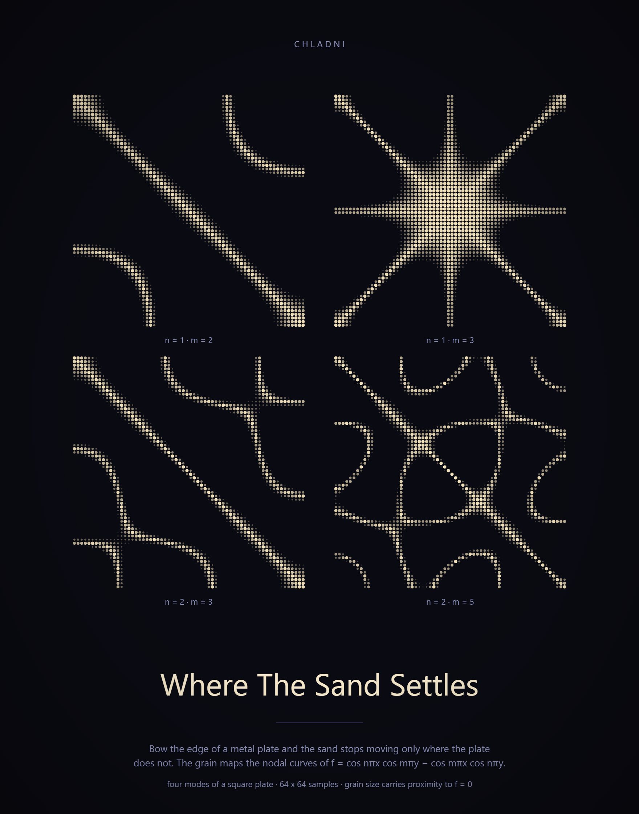
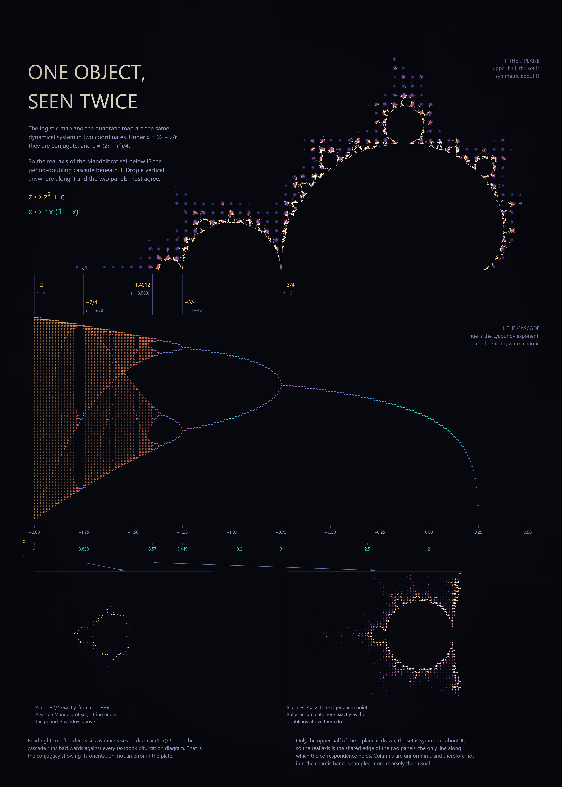
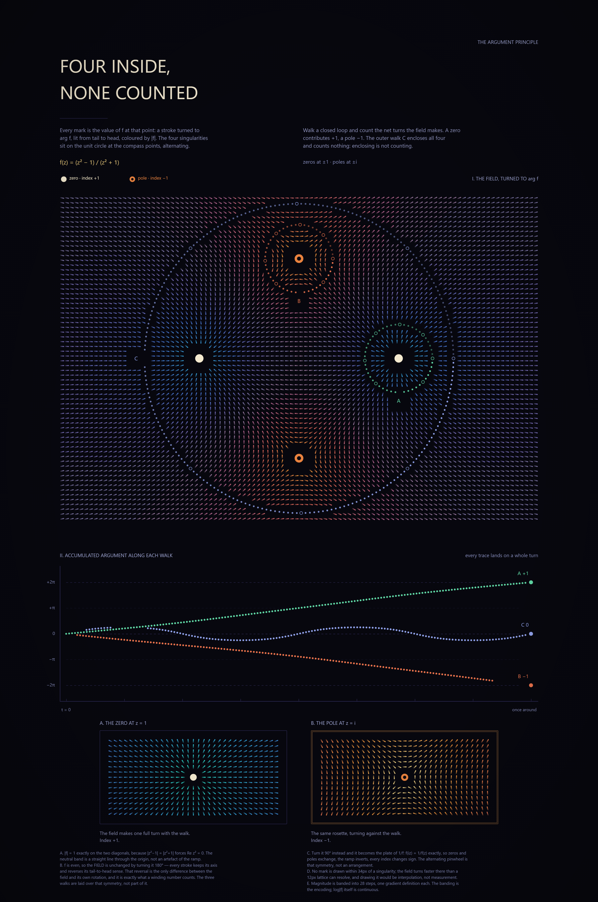
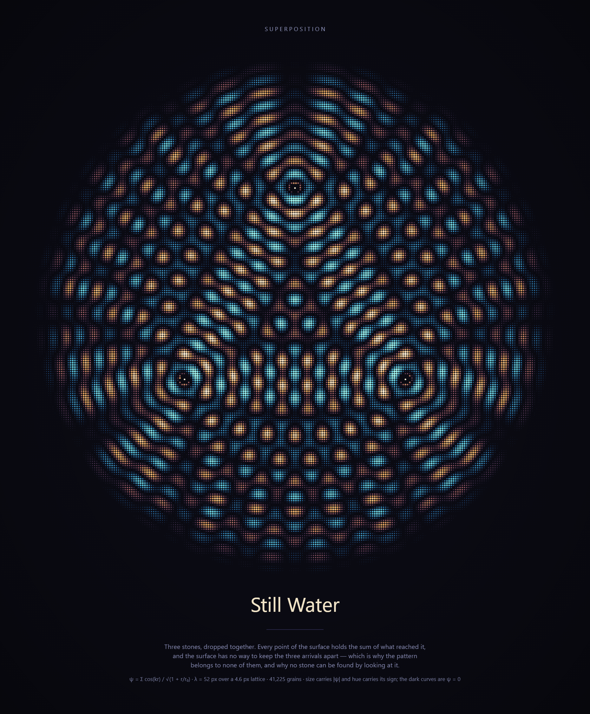
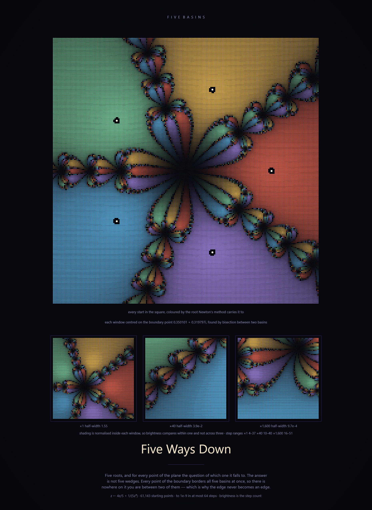
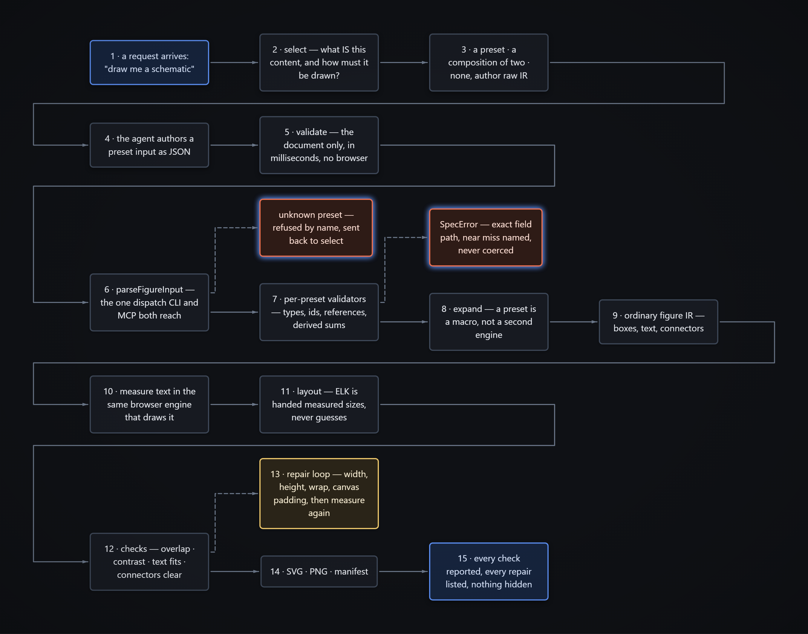
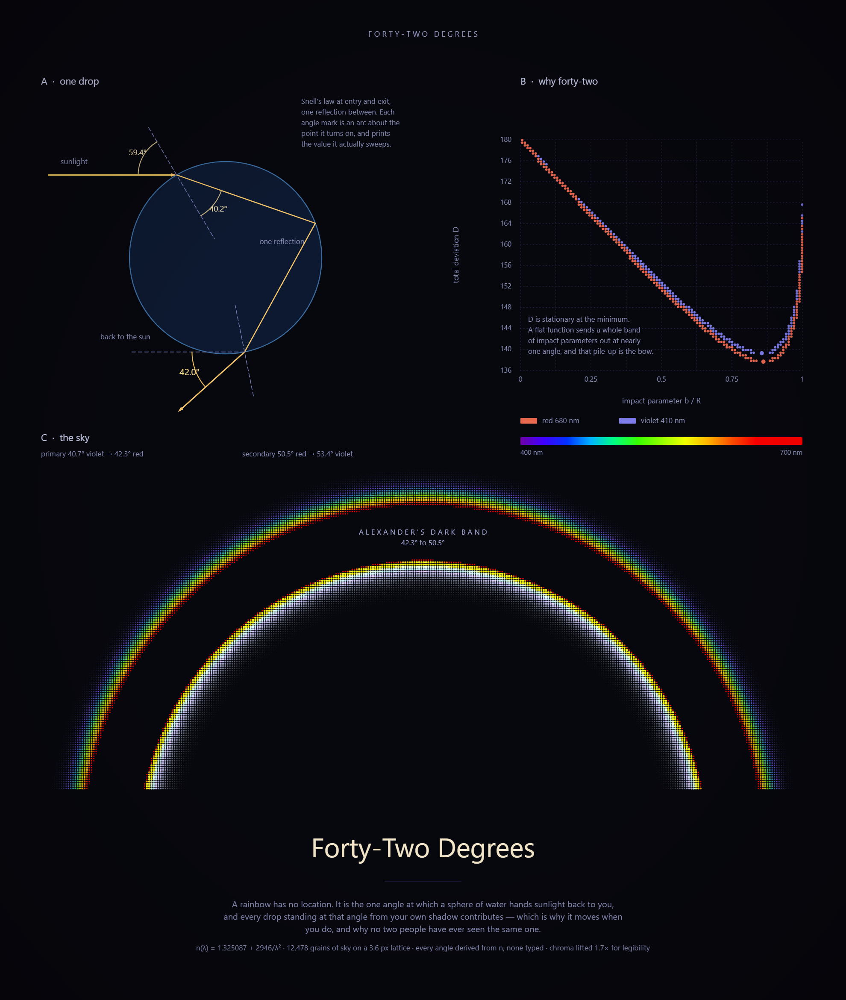
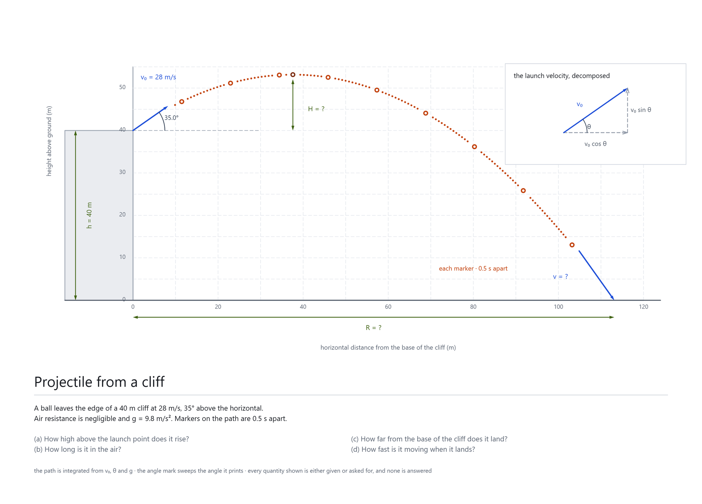

# Prancheta

[](https://github.com/JoaoVictor-C/Prancheta/actions/workflows/ci.yml)
[](LICENSE)

*Prancheta* — Portuguese for a drafting board: the flat surface a draftsman pins paper to, with a parallel rule and set squares, to draw something that has to be *correct*, not merely pretty.

## What this is

A toolkit that makes a coding agent competent at producing **complex visual representations**: schematics, technical figures, diagrams, mind maps, maps, annotated illustrations — still, or animated.

It renders a figure specification to SVG and PNG, **measures what it drew**, reports every geometric defect it found, and repairs what it can — emitting a manifest that says exactly what was drawn, what was changed, and what could not be fixed.

## The problem

An agent asked for a figure today does one of three things, and all three fail differently:

1. **Calls an image model.** Diffusion models draw plausible-looking pixels, not correct structure. Labels come out garbled, arrows point the wrong way, counts are wrong. Fine for illustration, disqualifying for a schematic.
2. **Emits Mermaid.** Safe, renders everywhere, and collapses into the same box-and-arrow flowchart regardless of what was asked. Anything that isn't a graph — a cross-section, an annotated timeline, a map with callouts, a figure with a real coordinate system — has nowhere to go.
3. **Writes raw SVG by hand.** Maximum expressive range, no layout engine. The agent is doing arithmetic on coordinates in its head and cannot see the result: text overflows its box, labels collide, arrows cross shapes.

The common failure is not artistic. It is that **the agent never looks at what it drew**, and has no vocabulary between "flowchart" and "raw coordinates."

## The bet

Correct figures come from **code, not pixels**, plus a **render–inspect–repair loop** that closes on an actual rasterized image, plus a **repertoire** of figure kinds broader than the graph.

## Gallery

Seven generator experiments from [experiments/generators](experiments/generators) and one figure of the pipeline itself, rendered through the same pipeline as every other figure here. Each generator is a program you run once; it writes a spec, and `render` draws it. **Every plate below passes its own checks** — that is the only claim being made for them, and it is not the same as being any good.

### Fields

Computed mark fields. All five are built from discrete separated marks on a lattice, because `boxes-do-not-overlap` leaves no other way to draw a curve that crosses itself.

|  |  |
|---|---|
|  |  |
| Four vibration modes of a square plate — sand settling along the nodal curves of `cos(nπx)cos(mπy) − cos(mπx)cos(nπy)`. | The logistic map's bifurcation cascade and the Mandelbrot set's real axis, shown as the same dynamical system in two coordinates. |
|  |  |
| The phase field of `(z²−1)/(z²+1)`: 6,000 strokes each **turned to** `arg f` and lit tail-to-head, with three closed walks whose accumulated argument lands on `+2π`, `−2π` and `0`. Rotation here is the data, not decoration — the plate could not have been drawn before blocks could turn. | Three stones dropped together. Mark size carries `\|ψ\|` and hue carries its sign, so the nodal curves draw themselves by being the only places the figure declines to put ink. λ is set against the lattice pitch rather than chosen: below about ten samples per wavelength the lattice beats against the wave and the fringes turn to speckle. |
|  |  |
| Newton's method for `z⁵ = 1`, 61,143 starting points coloured by the root each one reaches. The strip is a single descent into one boundary point — found by bisection between two basins, not by eye — at ×1, ×40 and ×1600. It looks the same at every scale because the boundary is a Wada set: every point of it borders all five basins at once. |  |

### Figures

Coordinate frames, free marks, connectors and angle marks — the things a mark field never touches.

|  |  |
|---|---|
|  |  |
| The pipeline drawing itself: what an agent does (1–5) and what runs inside (6–15), with the two refusal paths in orange. Wrapped into a square by ELK rather than laid out as one 4004px row — the spec is [beside it](docs/gallery/how-the-agent-uses-prancheta.json). | A rainbow in three panels: one drop, the deviation minimum that makes a bow, and the sky that follows. The local normal at each refraction point is a frame **aimed at** the drop's centre, so no angle is typed twice, and every angle mark prints the value its own arc sweeps. The one relaxation it asks for is `allowCurvedConnectors`, which an angle mark cannot exist without. |
|  |  |
| An exercise figure. Markers sit at equal **time** intervals, so constant horizontal spacing against changing vertical spacing says the two axes are independent without a sentence saying it. The path is integrated from `v₀`, `θ` and `g`; every unknown the question asks for is marked `?`, and none of them is answered. |  |

## Install

Needs **Node 22.18 or newer** — it runs the TypeScript directly, with no build step, so the runtime must strip types natively. Developed and tested on **Node 25**.

```bash
npm install && npx playwright install chromium
```

Chromium is a dependency, not a test convenience: the browser is the layout oracle, so nothing renders without it.

Python is optional, and only for the [figure modules](modules/README.md). Each module declares its own dependencies and several need none, so install them only if you want the modules:

```bash
python -m pip install -r modules/requirements.txt
```

## Quick start

```bash
npm run render fixtures/labelled-blocks.json
```

Writes `out/labelled-blocks.svg`, `.png` and `.manifest.json`, and prints one line per check. **Exit code is non-zero if a check failed**, so it works in a pipeline.

To see the repair loop work, render a figure whose sizes are wrong on purpose — first as authored, then repaired:

```bash
npm run render fixtures/broken-boxes.json -- --no-repair -o out/authored
```

```bash
npm run render fixtures/broken-boxes.json -- -o out/repaired
```

The second run prints what it changed and why, and the manifest records every edit. **Your spec is never modified**; repairs are applied to a copy, and `render()` returns the `effectiveSpec` that was actually drawn.

## How it works

```
spec → HTML mirror → Chromium lays out → measure boxes and text lines
     → checks → [repair → lay out again] → SVG → rasterise → manifest
```

**The browser is the layout oracle.** Text is measured in the same engine that will draw it — per character, grouped into lines, with the baseline found from a zero-height inline-block probe rather than guessed from font metrics. The HTML mirror exists only for measurement and is never exported.

That only holds while *the thing measured is the thing drawn*, which is why the mirror carries no effects, and why a whitespace bug that made a label measure narrower than it rendered was treated as a correctness failure rather than a cosmetic one.

**The PNG is rasterised from the exported SVG**, not from the mirror. If the SVG is wrong — a bad baseline, a missing glyph, an unsupported construct — the PNG shows it. Rasterising the mirror would prove nothing about the artefact anyone actually receives.

## What gets checked

Nineteen checks, deterministic and model-free, in [src/checks.ts](src/checks.ts). Eleven answer *is this figure malformed*. Four answer a narrower question that is not the same thing — *does this figure agree with itself* — and they exist because a figure can be perfectly well formed and still assert something untrue (ADR 0019). A pie is drawn by that machinery: a slice's printed share is measured against the angle it actually sweeps. The last four are *didactic*: what a figure made to teach from owes its reader (ADR 0024, 0025).

| check | what it asks |
| --- | --- |
| `text-fits-box` | Does every line of a label sit inside its block's content box? |
| `label-within-shape` | Does a label sit inside the shape actually drawn, not just its bounding rectangle? A label centred in a diamond can clear `text-fits-box` while its corners already sit outside the slanted sides. |
| `text-clear-of-other-boxes` | Does a label overlap a block that is not its own? |
| `boxes-do-not-overlap` | Do two boxes partially overlap? (Nesting is fine; partial overlap never is.) |
| `connector-clear-of-boxes` | Does a connector pass through a box it does not join? |
| `content-within-canvas` | Is everything inside the canvas? |
| `effect-within-canvas` | Does an effect's ink stay on the canvas? |
| `contrast-sufficient` | Does every label clear WCAG AA against whatever it actually sits on? |
| `categorical-colours-distinguishable` | Do the colours in a shared `categoryGroup` stay distinct under deuteranopia and protanopia? |
| `tick-labels-do-not-collide` | Do a scale's tick labels overlap each other? |
| `constraints-satisfied` | Does every declared layout constraint — align, distribute, keepClear, sameSize, anchor — hold in the figure as laid out? |
| `declared-size-honoured` | Was every block drawn at the size it asked for? A size below a block's own padding and border cannot be drawn, and the figure stays well formed while the instruction is overruled. |
| `annotation-nearest-its-owner` | Is every label nearer the element it names than to any other? A reader attributes a label to whatever it sits closest to. |
| `sweep-matches-its-label` | Does an angle mark sweep the angle its own label prints? |
| `arc-is-circular` | Are both ends of every arc the same distance from the centre it turns about? An arc stated as two endpoints *and* a centre is over-determined, and the three can disagree. |
| `axis-number-present` | Is every number an axis promised (`GridAxis.require`) printed within half a division of its tick? The intercept an exercise cites is the number a tidy placer drops. |
| `series-distinguishable-without-colour` | Can every data series be told apart without colour — a direct label on the drawing, or a stroke pattern of its own? A legend does not count. |
| `curve-label-nearest-its-curve` | Is every curve label nearer the curve it names than any other curve? |
| `feature-on-its-curve` | Does every marker lie on what it claims — a root on its curve *and* on the x axis? |

Two more live in [src/anim/checks.ts](src/anim/checks.ts) and run over the *interior* of an animated transition rather than over a static figure; see [Animation](#animation) below.

Each reports `pass`, `fail`, or **`not-applicable`** — a real third state, never a polite pass. A check that examined zero elements has verified nothing, and reporting that as a pass reads as coverage.

Failures carry structured overflow numbers, not just prose, because the repair engine has to act on them.

## Constraint toggles

Three of the refusals above block whole genres — a Venn diagram *is* partial overlap, a callout into a dense field *is* a line crossing boxes it does not join. Those three, and only those three, can be stood down per figure via `canvas.constraints`:

| toggle | stands down | reach for it when |
| --- | --- | --- |
| `allowOverlap` | `boxes-do-not-overlap` | Venn and Euler diagrams, circle packings, stacked annotations |
| `allowConnectorCrossing` | `connector-clear-of-boxes` | leader lines into a dense field, wiring that has to cross |
| `allowCurvedConnectors` | nothing — it *permits* `Connector.curve` | flowcharts, mind maps, org charts |

```json
{ "canvas": { "constraints": { "allowOverlap": true } } }
```

All default to `false`, so a spec that says nothing is checked exactly as it was before these existed.

**A relaxed check reports `not-applicable`, never `pass`** — and names the toggle that excused it. A pass claims the figure was examined and found sound; if a stood-down check said `pass`, a figure whose boxes genuinely do not collide and one that simply asked not to be looked at would produce identical manifests.

Curves come in three kinds — `arc` (bows by a fraction of its own chord, so it works with auto-routed endpoints), `bezier` (explicit control points, in scene coordinates), and `spline` (rounds a route's corners by `radius` and leaves its straight runs alone, which is what a graph edge needs). **A curve is checked as it is drawn:** it is flattened into the same polyline `connector-clear-of-boxes` walks, so it cannot bow through a box the check just cleared. Flattening is adaptive to a stated 0.05px bound — a tenth of the half-pixel every check tolerates — so a curve can never pass or fail on the strength of how it was sampled rather than where it goes.

A connector from a block back to itself is a **self-transition**, routed out of the top edge and back rather than curved, so a loop needs no toggle to exist.

See [docs/CONSTRAINTS.md](docs/CONSTRAINTS.md) for how to use them and [ADR 0010](docs/decisions/0010-constraint-toggles.md) for why these three and not the others.

## Repair

A verifier that can only *detect* is worth little. The repair loop grows a box that its label overflows, flips `wrap` when a node has hit its growth budget, and grows canvas padding when an effect's halo is clipped.

Two properties make it trustworthy, and both are structural rather than hoped for:

- **Monotone.** Every edit strictly increases one bounded quantity, or flips `wrap` from `none` to `normal`, which can happen at most once per node. A cycle would require some quantity to return to a previous value, so the loop cannot oscillate.
- **Bounded.** Growth is capped at a multiple of the node's *original* measured size. A node needing more is reported as `unrepaired` with the reason, rather than inflated without limit — a box four times the size the author asked for is not a repair, it is a different figure.

## Choosing before drawing

The failure this project exists to prevent is reaching for a flowchart because a flowchart is available. Ask first:

```bash
node src/cli.ts select --structure scene --idiom annotated
```

It answers with a preset, a composition of two, or *no preset fits — author raw IR*, and names the rules that decided. [docs/selection/SELECTION.md](docs/selection/SELECTION.md) is the hand-written reasoning and the part worth reading; [docs/selection/RULES.generated.md](docs/selection/RULES.generated.md) is the generated rule reference.

## The repertoire

**Seven presets**, drawn with the core's own IR — see [src/presets](src/presets):

| preset | what it is |
| --- | --- |
| [`labelled-blocks`](src/presets/labelled-blocks/PRESET.md) | Stacked labelled boxes; the plain case. |
| [`graph`](src/presets/graph/PRESET.md) | Nodes and edges, skeleton laid out by ELK. |
| [`mindmap`](src/presets/mindmap/PRESET.md) | A single-rooted tree radiating outward. |
| [`annotated-figure`](src/presets/annotated-figure/PRESET.md) | A shape or scene with callouts on leader lines. |
| [`chart`](src/presets/chart/PRESET.md) | Bar, line and scatter: values with a scale, not a graph. |
| [`function-graph`](src/presets/function-graph/PRESET.md) | Curves y = f(x) as data: expressions, tangents and secants, open and closed points, computed labels. |
| [`sign-chart`](src/presets/sign-chart/PRESET.md) | The sign table of a function — signs of f, f′, f″ or a product's factors, and where f rises and falls — found from the expression, never typed. |

**A function graph is data, not code.** Functions are expressions the core parses itself (no `eval`), points are read off them, tangents and secants are computed, and every label is a template — `"P{coords}"` prints `P(3; 9)` from f(3); a coordinate typed by hand is refused. Numbers go through one pt-BR formatter shared with the text around the figure: decimal comma, `(2,5; 7,25)`, the minus `−`, `17/3` rather than a rounded decimal. Axis numbers are never dropped (a number with ink on its spot slides along its own gridline), the zero line is always drawn when the range contains zero, and the legend searches for free space. The fourteen curves of a real Cálculo 1 exercise list are its fixtures ([fixtures/function-graph](fixtures/function-graph)).

**Free outlines** where a box cannot reach. A `Mark` is a start point and a run of segments — lines, and circular arcs about a stated centre — flattened at layout time into the polyline every check walks, at the same 0.05px bound a curved connector uses. It carries no label and takes no part in layout: it is ink, painted beneath everything else, and a filled one is a surface `contrast-sufficient` reads. This is what draws the region between a chord and its arc, which no inscribed polygon can express.

**Frames**, so a figure's own numbers appear once. A frame is a coordinate system — origin, units, and a rotation either stated or *aimed* at another point — resolved to canvas coordinates before anything measures or checks. An incline drawn at 30° is a frame rotated 30°; the slope, the block on it and the normal force are all positioned in that frame, so none of them can disagree with it. Origins compose, `Frame.grid` draws a numbered coordinate plane, and a tick across AB is a block on the y axis of a frame aimed from A at B — which needs no trigonometry, and never writes AB's angle down where it could be wrong.

**Thirteen block shapes** — seven geometric (`rect`, `circle`, `ellipse`, `diamond`, `hexagon`, `stadium`, `triangle`) and six symbols (`parallelogram`, `trapezoid`, `chevron`, `cross`, `star`, `note`). Every one is a polygon, deliberately: `shapeVertices` hands the same vertex list to `inPolygon` for containment and to the `<polygon>` for drawing, so `label-within-shape` answers about the shape on the page rather than an approximation. A curved symbol — a cylinder, a cloud — would break that identity and is not offered. [docs/design/GEOMETRY.generated.md](docs/design/GEOMETRY.generated.md) states each one's inscribed area, which is what tells a container from a marker: a `star` holds 27.6% of its bounding box and a `cross` 55.2%, and neither will take an ordinary label.

**Seven figure modules** (`node src/cli.ts modules`), in Python, for geometry the core cannot compute — crystal unit cells, dendrograms, gene maps, real maps, molecules and reaction schemes, least-squares fits, Skew-T soundings. Function curves were a module too, until the core learned to evaluate them ([ADR 0025](docs/decisions/0025-function-graph-absorbs-plot.md)). It was eleven: four rows stopped clearing the bar that puts a figure outside the core at all, and one was never a separate module. The index, and the record of what came out and why, is [modules/README.md](modules/README.md).

The module contract is that **the module declares semantics and the core measures geometry**. A module says what it drew and what each element means; it may not certify that what it drew is correct. Nobody certifies their own work.

## Colour, and leaving the tool

Colour is checked, not chosen. `contrast-sufficient` computes real WCAG contrast for every label against what it actually sits on; `categorical-colours-distinguishable` simulates deuteranopia and protanopia over any blocks a spec tags with a shared `categoryGroup`. Three theme variants — `dark` (default, unchanged), `light`, `print` — via `canvas.theme` in a spec, or `node src/cli.ts themes` to see every role's real contrast ratio.

```bash
node src/cli.ts render spec.json --fontEmbed outline --pdf --pdfSize a4
```

A figure can leave the tool as a deliverable, not just a correct drawing: every element carries a `<title>`/`<desc>` built from data the manifest already has, and sits in its own `<g>`. Every figure is set in Prancheta's own bundled font (Inter, SIL OFL, loaded as "Prancheta Sans"), and presets plan their layouts with that font's real advance widths, so a figure lays out the same on every OS. `--fontEmbed embed`, the default, inlines it as a `@font-face` (about 330 KB per SVG); `--fontEmbed outline` converts every glyph to a filled path with zero runtime font dependency, verified against resvg with no system fonts available at all — the mode to reach for when the target tool is unknown; `--fontEmbed none` only names the font. `--pdf` writes real vector PDF, sized to the figure by default or to a physical page (`a4`, `letter`, `<w>x<h>mm`).

## Depth cues, if they carry information

Blocks and connectors can take one of fourteen named effects — `raised-1/2/3`, `recede`, `emphasis`, `alarm`, `lit`, `inset`, `seated`, `etched`, `ghost`, `outlined`, `printed`, `depth-of-field` — for cases where layering, focus or contact is real information rather than polish.

```bash
node src/cli.ts effects
```

That lists every effect **and how far past its own edges it puts ink**, because that is what has to fit on the canvas.

An effect never changes layout: it is resolved after measurement, so the geometry checked is the geometry drawn. A halo clipped by the canvas edge is a reported defect that the repair loop fixes by growing the padding, not by moving anything. Everything desugars to SVG 1.1 filter primitives, and a test rasterises each effect under resvg with and without its filter to prove it is not being silently ignored.

[docs/effects/EFFECTS.md](docs/effects/EFFECTS.md) is the narrative; [docs/effects/REFERENCE.generated.md](docs/effects/REFERENCE.generated.md) is the generated parameter and bleed reference.

## A whole look, named once

Writing `effect` on every element by hand and keeping the choices consistent is the author's job only until there is a pack for it. `canvas.style` names one — `elevated`, `neon`, `spotlight`, `etched` — applied by the `role` an element already declares.

```bash
node src/cli.ts styles
```

That prints each pack with the bleed every role costs, which is the real difference between them. A pack **fills only absences** (an authored `effect` wins), **never styles a `callout`**, and **buys no exemption**: it is applied before `normalise`, so from there down a packed effect is indistinguishable from a hand-written one — same bleed arithmetic, same `effect-within-canvas`, same repair growing `canvas.padding`.

`canvas.type` names a **type pack** — `grotesk`, `editorial`, `poster`, `technical` — over seven levels (`display · title · subtitle · body · caption · eyebrow · mono`).

```bash
node src/cli.ts type
```

Type keys on `level` (how loud) rather than `role` (what it means), because the two are independent: a poster's date line is the largest type on the page and means nothing, while a safety notice may be the smallest and mean the most. A warning caption is `{ "role": "warning", "level": "caption" }`, which is exactly what it is.

Tracking goes into the measurement mirror as well as the SVG and is read back from `getComputedStyle`, so the width Chromium measured and the width drawn cannot drift — emitting it only at draw time would make `text-fits-box` a lie on every tracked label. `type` also names which levels fall back to an unbundled face, since only Inter travels with the tool; a pack is self-contained only when *every* level's first-choice face is bundled, and that is derived rather than asserted.

[docs/design/TYPOGRAPHY.md](docs/design/TYPOGRAPHY.md) is the reasoning.

## Diffing two states

```bash
node src/cli.ts diff fixtures/pipeline-before.json fixtures/pipeline-after.json
```

Lays out both and reports named deltas over stably identified elements — appeared, disappeared, moved, resized, restyled, retexted. Stable identity is what makes the next section possible: `animate` runs this diff over every consecutive pair of states.

## Animation

```bash
node src/cli.ts animate fixtures/animate/seq-0.json fixtures/animate/seq-1.json fixtures/animate/seq-2.json
```

Two or more states of one figure, tweened into a single animated SVG: eased translation for boxes that moved, crossfades for those arriving and leaving, `d`-tweened routes for connectors whose endpoints moved, optional per-element stagger via `motion: { start, end }`, and `prefers-reduced-motion` honoured in the emitted CSS. Everything runs on one clock as CSS `@keyframes` — never SMIL, which `getAnimations()` cannot see and which would put one figure's halves under two timebases.

**The motion is checked, not merely emitted**, and the checks answer about the *interior* of each transition rather than only its endpoints:

| check | what it asks |
| --- | --- |
| `boxes-do-not-overlap-during-transition` | Do two boxes collide at any instant between the two states, including while one is still fading out? |
| `connector-clear-of-boxes-during-transition` | Does a moving route sweep through a box it does not join? |

Both are closed form, with no sampling tolerance anywhere. Boxes translate affinely, so overlap is a quadratic in `t`; a moving segment needs a third separating axis — its own normal — which *turns* as the line moves, making the corner cross products quadratic too. [src/anim/sweep.ts](src/anim/sweep.ts) cuts `[0,1]` at every real root of all twelve polynomials and settles each piece with one evaluation, by the intermediate value theorem. It was validated against the static predicate over 16M random and 60M adversarial comparisons with zero mismatches.

Easing is free, and that is a proof rather than a hope: every element shares one monotone reparametrisation of time, so "overlaps somewhere strictly inside" is invariant under it. Easing functions that would break the premise are refused by name — `steps()` skips ranges of the parameter where an overlap can hide, and an overshooting cubic Bezier is rejected by `0 <= y1 <= y2 <= 1`.

Three refusals rather than known limitations: a route whose two states flatten to different vertex counts (CSS swaps discretely instead of tweening), a moving route carrying an arrowhead (nothing CSS-animatable moves the head in step), and an element that disappears and returns under the same id. A sequence is also refused when two consecutive states share no persisting element — that is two figures back to back, not one figure evolving.

Six ADRs: [0012](docs/decisions/0012-animation-m11-scope.md) scope · [0013](docs/decisions/0013-animation-m11-1-check-what-renders.md) check what renders · [0014](docs/decisions/0014-animation-m11-2-motor.md) the motor · [0015](docs/decisions/0015-animation-m13-stagger.md) stagger · [0016](docs/decisions/0016-animation-m14-sequences.md) N-state sequences · [0017](docs/decisions/0017-animation-m15-routes.md) routes.

## Commands

| command | what it does |
| --- | --- |
| `render <spec>` | Render to SVG, PNG and a manifest. `--out` `--scale` `--repair` `--maxPasses` `--maxScale` `--fontEmbed` `--pdf` `--pdfSize` |
| `validate <spec>` | Check a spec or preset input **without drawing it** — shape, references and arithmetic, no browser launched. |
| `select` | Rank presets for content predicates. `--structure` `--idiom` |
| `presets` | List the repertoire and whether each is implemented. |
| `rules` | Print the selection rule table. |
| `effects` | List every named effect, its chain, and its bleed. |
| `themes` | List every palette, its roles, and whether each role's text clears WCAG AA against its own fill. |
| `styles` | List the style packs and the bleed each role costs. |
| `type` | List the type packs: family, size, weight and tracking per `level`. |
| `modules` | List the figure modules, what each needs installed, and a command that runs it. |
| `module <command>` | Run a figure module and verify what it drew. `--args` `--width` `--height` `--out` |
| `diff <before> <after>` | Report what changed between two states of a figure. |
| `animate <state...>` | Tween two or more states into an animated SVG, with the motion checked. `--durationMs` `--delayMs` `--loop` `--easing` |
| `sheet <file>` | Build an exercise sheet from one JSON file: every figure rendered and checked, HTML + KaTeX, an A4 PDF, a PNG per page (PyMuPDF), an answer key generated from the answers. Writes to `ProjectHub/Listas/<name>/`. `--out` `--pdf` `--pages` `--dpi` `--katex` |

Run `node src/cli.ts <command> --help` for the full options of any one.

### Exercise sheets

```bash
node src/cli.ts sheet experiments/exercises/calculo1/lista.json
```

A sheet is one document: per exercise a `level`, a `statement`, a `figure` (a `function-graph` input), an `answer` and a `solution`, in HTML with KaTeX. The answer key is generated from `answer`, and the same field closes each worked solution, so the two cannot disagree. `{{fig.P}}` in the text prints point P of the exercise's figure through the formatter its label uses — `\left(2;\,5\right)` inside math, `(2; 5)` outside. The command fails, naming each one, on a KaTeX error, a broken image or a figure that failed a check. [ADR 0026](docs/decisions/0026-the-sheet-command.md); the converted Cálculo 1 list is [experiments/exercises/calculo1](experiments/exercises/calculo1).

## From an agent

```bash
npm run mcp
```

Speaks MCP over stdio. Every command above appears as a tool, **generated from the same table the CLI uses**, and the knowledge tree is served as `prancheta://` resources: the selection narrative, the rule reference, the effects narrative, the module index, and one resource for every preset and every module.

A hand-written second binding drifts — a flag gets added to the CLI, the MCP tool keeps the old shape, and nobody notices because nothing compares them. Here a drift is a type error, and a test asserts the two surfaces enumerate the same commands.

`.claude/skills/prancheta/SKILL.md` and `AGENTS.md` are *generated views* of the same knowledge (`npm run gen:views`, enforced by `npm run check:views`).

## Development

| script | what it does |
| --- | --- |
| `npm run check:all` | Everything below that gates: typecheck, both suites, both staleness checks, and the root-clean check. `npm run validate` is an alias. |
| `npm test` | The core suite. Node and Chromium only — green on a fresh clone with no Python installed. |
| `npm run test:modules` | The Python module suite. Spawns every module for real, and **fails rather than skips** when an interpreter or import is missing. |
| `npm run test:all` | Both. |
| `npm run typecheck` | `tsc --noEmit`. |
| `npm run check:independent` | Re-render exported SVGs with resvg — a Rust engine, no browser — to confirm they survive outside the engine that made them. |
| `npm run check:fonts-travel` | Render with `--fontEmbed outline` and `embed` and confirm both survive with no system fonts available at all. |
| `npm run check:docs` | Both staleness checks below. |
| `npm run check:views` | Fail if `AGENTS.md` or the skill is stale. |
| `npm run check:refs` | Fail if any of the four generated references — rules, effects, palette, geometry — is stale. |
| `npm run check:root-clean` | Fail if anything not on ADR 0011's list has appeared in the root. |
| `npm run gen:views` / `gen:rules` / `gen:effects` / `gen:palette` / `gen:shapes` | Regenerate them. |

Generated files are generated for a reason: a hand-written table of effect bleed figures or selection rules would be wrong within a release and nothing would notice. What each thing is *for* stays hand-written, because that is the part a generator cannot produce.

## Decisions

- **Language: TypeScript** — Node mandatory, Python optional. [0001-language](docs/decisions/0001-language.md)
- **Shape: one repo, one version** — typed library (contract) → CLI → MCP adapter; the Claude skill is a generated view. [0002-deliverable-shape](docs/decisions/0002-deliverable-shape.md)
- **Repairs are edits, not mutations** — a monotone, terminating loop. [0003-repairs-are-edits](docs/decisions/0003-repairs-are-edits.md)
- **Selection is a rule table with a hand-written narrative** — CI tests the decision procedure, not the model. [0004-selection-core](docs/decisions/0004-selection-core.md)
- **Modules declare semantics; the core measures geometry** — nobody certifies their own work. [0005-module-protocol](docs/decisions/0005-module-protocol.md)
- **Effects are checked geometry** — a shadow is ink, its reach is computed, and a clipped halo is a defect. [0006-effects-are-checked-geometry](docs/decisions/0006-effects-are-checked-geometry.md)
- **Three constraints may be stood down, and say so** — a relaxed check reports not-applicable, never pass. [0010-constraint-toggles](docs/decisions/0010-constraint-toggles.md)
- **Animation is checked motion, or it is not shipped** — six ADRs, each new freedom arriving with the check that constrains it, and a camera refused because no check for it can exist. [0012](docs/decisions/0012-animation-m11-scope.md)–[0017](docs/decisions/0017-animation-m15-routes.md)
- **Geometry a figure derives, and labels that may sit on what they name** — where a figure can compute its geometry from the quantity it asserts, the two cannot disagree; a check is for the gap derivation cannot reach. [0019-derived-geometry-and-annotation](docs/decisions/0019-derived-geometry-and-annotation.md)
- **One browser per process, and a loop you do not dread** — 195 Chromium launches per run was the cost; the fix is a batch resource, and the ladder `test:one` → `test:fast` → the suite. [0020-the-test-loop](docs/decisions/0020-the-test-loop.md)
- **Opening the repository** — a licence that is granted and not merely declared, secrets ignored by the clone rather than by one developer's machine, and a suite split by dependency so a fresh clone runs green without Python. [0021-opening-the-repository](docs/decisions/0021-opening-the-repository.md)
- **The preset input is validated, and the line against the checks is drawn at repair** — the one surface an agent authors was the one surface nothing read. [0018-preset-input-validation](docs/decisions/0018-preset-input-validation.md)
- **Function graphs are a preset, and a figure is data** — expressions parsed by a closed grammar, labels computed, typed coordinates refused. [0022-function-graph-preset](docs/decisions/0022-function-graph-preset.md)
- **One number formatter for the figure and the text** — `(2,5; 7,25)`, `−`, `17/3`. [0023-one-number-formatter](docs/decisions/0023-one-number-formatter.md)
- **Didactic checks** — a number the exercise cites is on the axis, curves are told apart without colour, labels sit by what they name. [0024-didactic-checks](docs/decisions/0024-didactic-checks.md)
- **function-graph absorbs the plot module's curves** — one evaluator of one expression language; the module keeps least-squares fits. [0025-function-graph-absorbs-plot](docs/decisions/0025-function-graph-absorbs-plot.md)
- **The sign table is found from the function** — roots, poles and signs computed, √3 printed as √3; it sits beside the graph and cannot contradict it. [0027-sign-chart](docs/decisions/0027-sign-chart.md)
- **An exercise sheet is one document** — the answer written once, numbers in the text computed from the figures, every error returned. [0026-the-sheet-command](docs/decisions/0026-the-sheet-command.md)

## Further reading

- [ROADMAP.md](ROADMAP.md) — everything done and planned, in order, with what each step found. Start here.
- [docs/PLAN.md](docs/PLAN.md) — the milestones in detail, M0 to M4.
- [docs/PLAN-NEXT.md](docs/PLAN-NEXT.md) — M5 to M10, with the gap analysis against human-oriented figure tools that produced them.
- [docs/research/landscape.md](docs/research/landscape.md) — survey of existing tools, libraries, agent skills, and academic work.
- [docs/research/language-choice.md](docs/research/language-choice.md) — Python vs TypeScript, with a recommendation.
- [docs/research/candidate-modules.md](docs/research/candidate-modules.md) — the survey the module repertoire was drawn from.

## Contributing

Issues and pull requests are welcome. [CONTRIBUTING.md](CONTRIBUTING.md) covers setup, where code belongs, and what a review looks for; participation is under the [Code of Conduct](.github/CODE_OF_CONDUCT.md). Security problems go through the [security policy](.github/SECURITY.md) rather than the issue tracker.

The most useful feature request is a **figure you could not draw**. The concrete figure is what says whether the answer is a preset, a module, or a new primitive.

## Licence

MIT — see [LICENSE](LICENSE).

Bundled third-party assets keep their own terms: Inter under the SIL Open Font License, and the Natural Earth and public-domain image data used by the modules and experiments. Each one's source and licence is recorded in [assets/README.md](assets/README.md).

## Non-goals

- Competing with design tools for human-driven editing.
- Photorealism or artistic illustration. The effects layer is schematic depth *cues*, deliberately restrained; it is not a rendering engine.
- Verifying that a figure is **true**. Almost every check here answers malformation, not misrepresentation: a regression fitted to meaningless data, or a map with the wrong country shaded, passes all of them. The exceptions are narrow and stated — a stated angle is checked against the arc drawn for it, and a figure module may declare that one thing it drew lies on another, which the drawing can then refuse.
- Encoding to video. Animation ships as an SVG that honours `prefers-reduced-motion`; a frame-sequence encoder would destroy exactly that, so it could at most be an explicitly lossy convenience, never the deliverable ([ADR 0016](docs/decisions/0016-animation-m14-sequences.md)). Shape morphing and a camera are refused on the same page, and for a camera permanently: legibility under zoom has no check, and none can exist without a research-grade advance.
